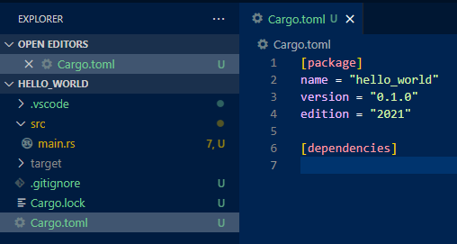

# Recap

Enums can be used as classic C enums:
```rust
#[derive(PartialEq)]
enum Color {
    Red = 2,
    Green = 10,
    Blue,
}
```
Or as sum types that can contain different types inside them:
```rust
enum Values {
    Integer(i32),
    Float(f32),
    Character(char),
    Null
}
```
These can checked in the following ways:
```rust
let x = Color::Red;
if x == Color::Blue {
    // ...
}

let v = Values::Integer(5);

if let Values::Integer(x) = v {
    // do something with an i32
}

match v {
    Values::Integer(x) => {}, // do something with an i32
    Values::Float(y) => {}, // do something with an f32,
    _ => {}, // for all the other variants
}
```
The `Option` type can be used to represent a value that might be missing, and the `Result` type represents a value that is either an ok value, or an error. Both of these can be propagated using the `?` operator.
```rust
fn f1() -> Option<u32> {
    Some(5)
}
fn f2() -> Option<u32> {
    Some(10)
}
fn g() -> Option<u32> {
    let x = f1()?;
    let y = f2()?;
    let sum = x + y;
    Some(sum)
}
```
A typical usage of `Result` and error propagation might look something like:
```rust
enum MyError {
    DivByZero,
}
fn f(x: u32, y: u32) -> Result<u32, MyError> {
    if y == 0 {
        Err(MyError::DivByZero)
    } else {
        Ok(x / y)
    }
}
```
Note: for functions that can fail but wouldn't return anything if it succeeds, the correct return type is `Result<(), Error>`.

Panicking can also be used as a way to handle an error that can't be processed:
```rust
let r1 = 20;
let r2 = 10;
if r1 > r2 {
    panic!("Expecting r1={r1} to be smaller than r2={r2}");
}
```

# Problems

For each problem, have code that checks both the success and fail cases.

1. Make a function that returns the next prime number following the number took as an argument, which has the `u16` type. If no such number exists (the next prime number will not fit in an `u16`), the function will return `None`. Example signature:
    ```rust
    fn next_prime(x: u16) -> Option<u16>
    ```
    Call this function repeatedly until you get a `None`, printing each prime.


2. Implement two functions for making checked addition and multiplication for the `u32` type. These functions can fail if the resulted value doesn't fit in an `u32`. If a failure occurs, use `panic` to end the application.

3. For the previous problem, instead of panicking, use the `Result` mechanism to return and propagate errors. Make an error type that represents this error case.
    
    Make another function that tries to use the above functions and propagate any errors that appear.

4. Make an error type that can represent the following errors:
    - character is not ascii
    - character is not a digit
    - character is not a base16 digit
    - character is not a letter
    - character is not printable

    Create the following functions that take a `char` as argument (each function can fail and will return the relevant error):
    - to_uppercase: fails if the input is not a letter
    - to_lowercase: fails if the input is not a letter
    - print_char: fails if the input is not printable
    - char_to_number: fails if the input is not ascii, or if it's not a digit
    - char_to_number_hex: fails if the input is not ascii, or if it's not a base16 digit
    - print_error: receives an error as input, and prints a human readable message for each error type

5. Make an application of your choice that uses `Option`, `Result`, or both.

# Bonus

While writing error types manually gives the most flexibility to the programmer, it is often tedious, and most error types are very simple. Because of this, there are ways to automate this using external crates.

A crate is Rust's idea of a package. Every project is made of one or more crates that put together make an executable or a library. `cargo` is the build tool and package manager that understand how crates work, which crate depends on which crate, and how to build the final artifact.

The primary way to find a crate that might help you is to look on [crates.io](https://crates.io/). This is also the main source that is considered by `cargo` when it's trying to build the project.

For this lab, we will be using the [thiserror](https://crates.io/crates/thiserror) crate to make it easier to write errors. The first step to make this happen is to go in the `Cargo.toml` file in your project:



[TOML](https://toml.io/en/) is a simple configuration format that is more powerful than an `INI`, and designed to be easily edited by hand by humans.

The `[dependencies]` tag say on what crates the current crate depends on. To make use of our new crate, we have to specify its name and the version we want to use. It is not necessary to spell out the exact version; for instance, if we say `1.0`, `cargo` will understand that it can choose any version that starts with that. At the time of this writing, it will choose `1.0.37` because that is the latest one and there's no other crate that has more restrictions on the version.

```toml
[dependencies]
thiserror = "1.0"
```

Remember to save the file! Now, when we execute the next `cargo` command, or when VSCode in background executes `cargo`, it will fetch the crate from GitHub and use it.

A typical usage looks like this:
```rust
use thiserror::Error;

#[derive(Error, Debug)]
enum MyError {
    #[error("{0} divided by zero")] // {0} will take the first value of the variant
    DivByZero(u32),
}
fn f(x: u32, y: u32) -> Result<u32, MyError> {
    if y == 0 {
        Err(MyError::DivByZero(x))
    } else {
        Ok(x / y)
    }
}
fn main() {
    match f(5, 2) {
        Ok(x) => println!("5/2={}", x),
        Err(e) => println!("err: {}", e),
    };
    match f(5, 0) {
        Ok(x) => println!("5/0={}", x),
        Err(e) => println!("err: {}", e),
    };
}
```

As an optional exercise, go back and use this crate for the problems where you made an error type by hand.