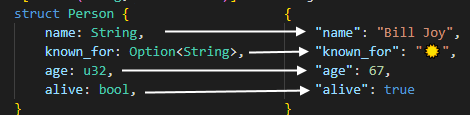

# Recap

Structs declaration and initialization:
```rs
struct Point {
    x: i32,
    y: i32
}

let p = Point { x: 5, y: 6 };
```
Arrays:
```rs
let array = [1, 2, 3];
let array: [u32; 3] = [1, 2, 3];
let array: [u32; 3] = [0; 3];
```

# Problems

## P1
A student has the following properties: name, phone and age. Read a file with the following format:
```
Constantin,0711111111,21
Mihai,0722222222,23
Elena,073333333333,25
Diana,0744444444,20
```
Find and print the oldest and the youngest student.

## P2

Create a canvas structure that can hold 10x50 characters that can be "painted" on, and the corresponsing functions, so [this](p2.rs) code compiles and runs properly. The canvas will be initialized with spaces, and have the possibility to set pixels knowing the coordinates and the values in the (x, y, ascii value) format, and print the canvas at the end.

## P3
Implement [life](https://en.wikipedia.org/wiki/Conway%27s_Game_of_Life). Have a matrix of constant values of elements (bool, u8, chars) that are read from a file, each element representing a cell that is either dead or alive. Each cell has 8 neighbors, and the number of neighbors it has contributes to whenever if it survives or not, with the following rules:

1. Any live cell with two or three live neighbours survives.
2. Any dead cell with three live neighbours becomes a live cell.
3. All other live cells die in the next generation. Similarly, all other dead cells stay dead.

Use [blinker (period 2)](life.game) and [pulsar (period 3)](life2.game) to test it. Simulate at least 3 transitions.

## Bonus
*Serializing* is the process of writing in-memory objects (structs, enums, simple types) into a format that can be *deserialized* later in order to yield the same object the process started with. The format is usually agnostic when it comes to processor architecture.

[Serde](https://crates.io/crates/serde) is a crate used for serializing and deserializing Rust types in a plethora of formats, the most used being JSON.
To use it, go to `Cargo.toml` and add the following under `[dependencies]`:
```toml
serde = "1"
serde_derive = "1"
serde_json = "1"
```
Serde is made out of several crates, each with its own purpose.
1. `serde` is the main crate that defines the interfaces and base types that every other crate uses
2. `serde_derive` is the crate that implement the macro that maps Rust's native types to something more generic
3. `serde_json` is the crate that implements the JSON format, using the other two

This crates use Rust's powerful type system to transform JSONs from and to strongly typed structs, enums, arrays, maps, etc. Usually, JSON objects map to a struct, JSON arrays map to an array or a vector, bools to bools, numbers to integers or floats, strings to strings.

Additionally, `Option`s are useful because they say that a field can be missing without erroring out.

Example:
```rs
use std::fs;
use serde_derive::Deserialize;

#[derive(Debug, Deserialize)]
struct Person {
    name: String,
    known_for: Option<String>,
    age: u32,
    alive: bool,
}

fn main() {
    let content = fs::read_to_string("person.json").unwrap();
    let p: Person = serde_json::from_str(&content).unwrap();
    println!("{:?}", p);
}
```
```json
{
    "name": "Bill Joy",
    "known_for": "☀️",
    "age": 67,
    "alive": true
}
```

Mapping:



## P4
Go back to P1 and solve it using JSONS. Each line now contains a JSON that describes the student, like so:
```json
{ "name": "Constantin", "phone": "0711111111", "age": 21 }
```